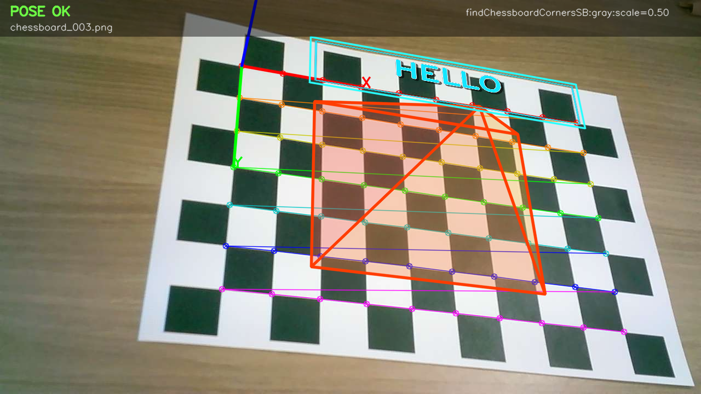
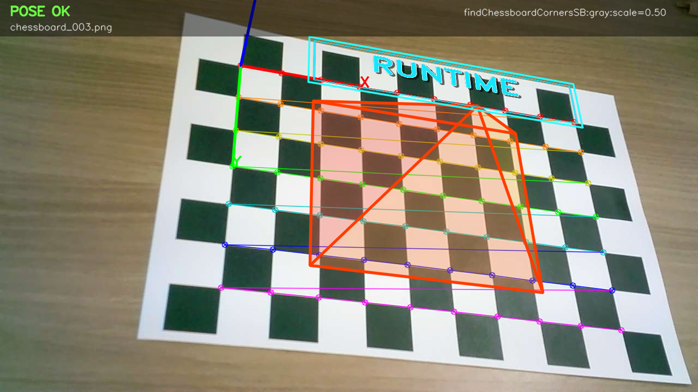

# BoardPoseAR

`BoardPoseAR`는 OpenCV 기반 카메라 자세 추정 및 체스보드 AR 텍스트 시각화 프로젝트입니다.

체스보드 코너를 검출한 뒤 `solvePnP`로 카메라 자세를 추정하고, 사용자가 입력한 문자를 체스보드 위 3D 평면에 AR처럼 투영합니다. 기본 실행에서는 별도의 `.npz` 파일을 읽지 않고 `calibration_data.py`에 저장된 파이썬 상수 카메라 파라미터를 사용합니다.

## 대표 결과 미리보기

아래 이미지는 실제 실행으로 생성된 대표 결과입니다.

### Python 상수 캘리브레이션 + 입력 텍스트 AR



결과 파일: [outputs/pose_demo.png](outputs/pose_demo.png), [outputs/pose_results.json](outputs/pose_results.json)

### Runtime 캘리브레이션 모드



결과 파일: [outputs/pose_demo_runtime.png](outputs/pose_demo_runtime.png), [outputs/pose_results_runtime.json](outputs/pose_results_runtime.json)

### 웹캠 녹화 데모

녹화 결과 파일: [outputs/pose_demo.avi](outputs/pose_demo.avi)

참고: GitHub README에서 .avi 파일은 브라우저에 따라 바로 재생되지 않고 다운로드 링크로 열릴 수 있습니다.

## 핵심 기능

- 체스보드 내부 코너 검출 (`10 x 7` 기준)
- 카메라 자세 추정 (`cv2.solvePnP`)
- 3D 좌표축 시각화
- 체스보드 위 반투명 3D 피라미드 렌더링
- 실행 시 입력한 텍스트를 AR 평면에 투영
- 이미지 폴더, 단일 이미지, 영상 파일, 웹캠 입력 지원
- 기본 `python` 캘리브레이션 모드와 선택형 `runtime` 캘리브레이션 모드 지원
- 웹캠 미리보기용 저해상도/축소 검출 옵션 지원
- 웹캠 미리보기에서 `R` 키로 녹화 시작/일시정지 지원

## 폴더 구성

- `pose_estimation.py`: 체스보드 코너 검출, 자세 추정, AR 오브젝트 투영을 수행하는 메인 스크립트입니다.
- `calibration_data.py`: 카메라 행렬, 왜곡 계수, 체스보드 패턴 크기를 파이썬 상수로 저장한 파일입니다.
- `data/captures/`: 포즈 추정 데모에 사용한 체스보드 입력 이미지입니다.
- `outputs/pose_demo.png`: 기본 실행 결과 이미지입니다.
- `outputs/pose_demo_runtime.png`: 런타임 캘리브레이션 모드 결과 이미지입니다.
- `outputs/pose_demo.avi`: 웹캠 실행으로 저장한 AR 포즈 추정 데모 영상입니다.
- `outputs/pose_frames/`: 입력 이미지별 포즈 추정 및 AR 시각화 결과입니다.
- `outputs/pose_results.json`: 검출 여부, `rvec`, `tvec`, 카메라 위치 정보가 저장된 결과 파일입니다.
- `requirements.txt`: 실행에 필요한 Python 패키지 목록입니다.

## 실행 환경

- Python 3.10+
- OpenCV (`opencv-python` 또는 `opencv-contrib-python`)
- NumPy

설치 예시:

```powershell
python -m pip install -r requirements.txt
```

## 실행 방법

### 1. 프로젝트 폴더로 이동

```powershell
cd C:\Users\owen0\Desktop\CV\BoardPoseAR
```

### 2. 패키지 설치

```powershell
python -m pip install -r requirements.txt
```

### 3. 기본 데모 실행

아래 명령은 `calibration_data.py`의 파이썬 상수 카메라 파라미터를 사용합니다.

```powershell
python pose_estimation.py --input data/captures --output outputs/pose_demo.png --output-dir outputs/pose_frames --results-json outputs/pose_results.json
```

명령을 실행하면 아래 프롬프트가 뜹니다. AR로 띄우고 싶은 영문/숫자를 입력하면 됩니다.

```text
AR text (default AR): HELLO
```

### 4. 프롬프트 없이 텍스트 지정

```powershell
python pose_estimation.py --text HELLO --input data/captures --output outputs/pose_demo.png --output-dir outputs/pose_frames --results-json outputs/pose_results.json
```

### 5. 런타임 캘리브레이션 모드 실행

참고 프로젝트처럼 입력 이미지에서 카메라 파라미터를 다시 계산한 뒤 자세 추정을 진행하고 싶다면 아래처럼 실행합니다.

```powershell
python pose_estimation.py --calibration-mode runtime --text RUNTIME --input data/captures --output outputs/pose_demo_runtime.png --output-dir outputs/pose_frames_runtime --results-json outputs/pose_results_runtime.json --min-calibration-frames 8
```

### 6. 웹캠으로 실시간 실행

```powershell
python pose_estimation.py --text LIVE --camera 0 --video-output outputs/pose_demo.avi
```

기본 상태는 미리보기입니다. `R` 키를 누르면 녹화를 시작하고, 다시 `R` 키를 누르면 녹화를 일시정지합니다. `ESC` 키를 누르면 종료됩니다.

실행 즉시 녹화를 시작하고 싶다면 아래 옵션을 추가합니다.

```powershell
python pose_estimation.py --text LIVE --camera 0 --record-on-start --video-output outputs/pose_demo.avi
```

### 7. 웹캠 미리보기가 끊길 때

가장 빠른 확인용 실행입니다. 해상도를 낮추고, 검출용 프레임을 더 작게 만들며, 영상 저장을 끕니다.

```powershell
python pose_estimation.py --text LIVE --camera 0 --camera-width 640 --camera-height 360 --camera-fps 30 --detection-scale 0.35 --display-scale 0.8 --no-video-save
```

결과 영상도 저장해야 한다면 `--no-video-save`만 빼고, 미리보기 창에서 `R` 키를 눌러 녹화를 시작하면 됩니다.

## 주요 옵션

- `--text`: AR로 표시할 텍스트입니다. 생략하면 실행 중 직접 입력합니다.
- `--input`: 입력 이미지, 이미지 폴더, 영상 파일 경로입니다. 기본값은 `data/captures`입니다.
- `--camera`: 웹캠 인덱스입니다. 예: `--camera 0`
- `--camera-width`, `--camera-height`: 웹캠 요청 해상도입니다. 기본값은 `960 x 540`입니다.
- `--camera-fps`: 웹캠 요청 FPS입니다. 기본값은 `30`입니다.
- `--detection-scale`: 체스보드 검출용 축소 비율입니다. 낮출수록 빠르지만 검출 정확도는 떨어질 수 있습니다.
- `--display-scale`: 미리보기 창에만 적용되는 축소 비율입니다.
- `--no-video-save`: 영상 저장을 끄고 미리보기만 실행합니다. FPS 확인용으로 유용합니다.
- `--record-on-start`: `R` 키를 기다리지 않고 실행 즉시 녹화를 시작합니다.
- `--calibration-mode`: `python`, `runtime`, `file` 중 선택합니다. 기본값은 `python`입니다.
- `--pattern-cols`: 체스보드 가로 내부 코너 수입니다. 기본값은 `10`입니다.
- `--pattern-rows`: 체스보드 세로 내부 코너 수입니다. 기본값은 `7`입니다.
- `--square-size`: 체스보드 한 칸의 실제 크기입니다. 단위는 자유롭게 맞추면 됩니다.
- `--output`: 대표 결과 이미지 저장 경로입니다.
- `--output-dir`: 이미지 폴더 입력 시 프레임별 결과 저장 폴더입니다.
- `--video-output`: 영상/웹캠 입력 시 결과 영상 저장 경로입니다.
- `--results-json`: 자세 추정 결과 JSON 저장 경로입니다.

## 알고리즘 개요

1. 입력 이미지 또는 영상 프레임을 읽습니다.
2. 웹캠 입력이면 요청 해상도와 FPS를 낮게 설정해 미리보기 성능을 우선합니다.
3. `cv2.findChessboardCornersSB`와 `cv2.findChessboardCorners`로 체스보드 코너를 검출합니다.
4. `--detection-scale` 값이 1보다 작으면 축소 프레임에서 코너를 검출하고, 좌표를 원래 프레임 크기로 되돌립니다.
5. 코너가 검출되면 `cv2.solvePnP`로 회전 벡터 `rvec`와 이동 벡터 `tvec`를 계산합니다.
6. `cv2.projectPoints`로 3D 축, 피라미드, 텍스트 평면의 3D 좌표를 이미지 좌표로 투영합니다.
7. 사용자가 입력한 텍스트를 투명 이미지로 만든 뒤 `cv2.getPerspectiveTransform`과 `cv2.warpPerspective`로 체스보드 위에 배치합니다.
8. 웹캠 미리보기에서는 `R` 키 입력에 따라 결과 영상을 `outputs/` 폴더에 저장하거나 일시정지합니다.

## 현재 데모 결과

| 항목 | 값 |
|---|---:|
| 기본 캘리브레이션 방식 | `python` |
| 체스보드 내부 코너 패턴 | `10 x 7` |
| 입력 이미지 수 | `11` |
| 자세 추정 성공 | `8` |
| 데모 텍스트 | `HELLO` |
| 대표 결과 이미지 | `outputs/pose_demo.png` |

## 결과 파일 설명

- `outputs/pose_demo.png`: 기본 모드에서 생성한 대표 AR 결과 이미지입니다.
- `outputs/pose_demo_runtime.png`: 런타임 캘리브레이션 모드에서 생성한 대표 AR 결과 이미지입니다.
- `outputs/pose_demo.avi`: 웹캠 녹화 모드에서 생성한 AR 결과 영상입니다.
- `outputs/pose_results.json`: 기본 모드의 자세 추정 결과입니다.
- `outputs/pose_results_runtime.json`: 런타임 캘리브레이션 모드의 자세 추정 결과입니다.
- `outputs/pose_frames/`: 입력 이미지별 결과 이미지가 저장됩니다.

`pose_results.json`에는 아래 정보가 포함됩니다.

- `calibration.mode`: 사용한 캘리브레이션 방식입니다.
- `ar_text`: 실행 시 입력한 AR 텍스트입니다.
- `detected_poses`: 전체 입력 중 자세 추정이 성공한 개수입니다.
- `rvec`: 체스보드 좌표계 기준 회전 벡터입니다.
- `tvec`: 체스보드 좌표계 기준 이동 벡터입니다.
- `camera_position_board`: 체스보드 좌표계에서 계산한 카메라 위치입니다.

## 참고 프로젝트와의 차이

참고한 `Dancing-on-the-chessboard`는 GIF 프레임을 PNG로 변환한 뒤 체스보드 위에 오버레이하는 구조입니다. `BoardPoseAR`는 같은 OpenCV 기반 자세 추정 흐름을 사용하지만, 사용자 입력 텍스트를 즉석에서 생성해 AR 평면에 투영하고, 기본 캘리브레이션 값을 별도 `.npz` 파일이 아닌 파이썬 상수로 관리합니다.

## 한계점

- `cv2.putText` 기반 텍스트 렌더링이므로 영문/숫자 입력을 권장합니다.
- 체스보드가 화면에서 잘리거나 흐리면 검출이 실패할 수 있습니다.
- 기본 카메라 파라미터는 현재 캡처 환경 기준이므로 다른 카메라에서는 `runtime` 모드나 새 캘리브레이션 값이 필요합니다.
- `--detection-scale`을 너무 낮추면 FPS는 좋아지지만 코너 검출 정확도는 떨어질 수 있습니다.
- 영상/웹캠 입력에서는 체스보드가 충분히 크게 보이고 조명이 안정적일수록 결과가 좋습니다.
